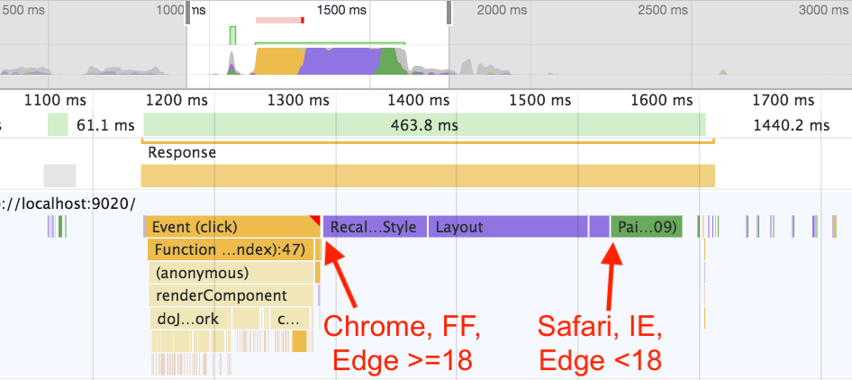

### requestAnimationFrame

As it turns out, requestAnimationFrame will be our main tool of choice, but there’s a problem. As Jake Archibald explains in [his excellent talk on the event loop](https://www.youtube.com/watch?v=cCOL7MC4Pl0), browsers disagree on where to fire this callback:

Now, per the HTML5 event loop spec, requestAnimationFrame is indeed supposed to fire before style and layout are calculated. Edge has already fixed this in v18, and perhaps Safari will fix it in the future as well. But that would still leave us with inconsistent behavior in IE, as well as in older versions of Safari and Edge.