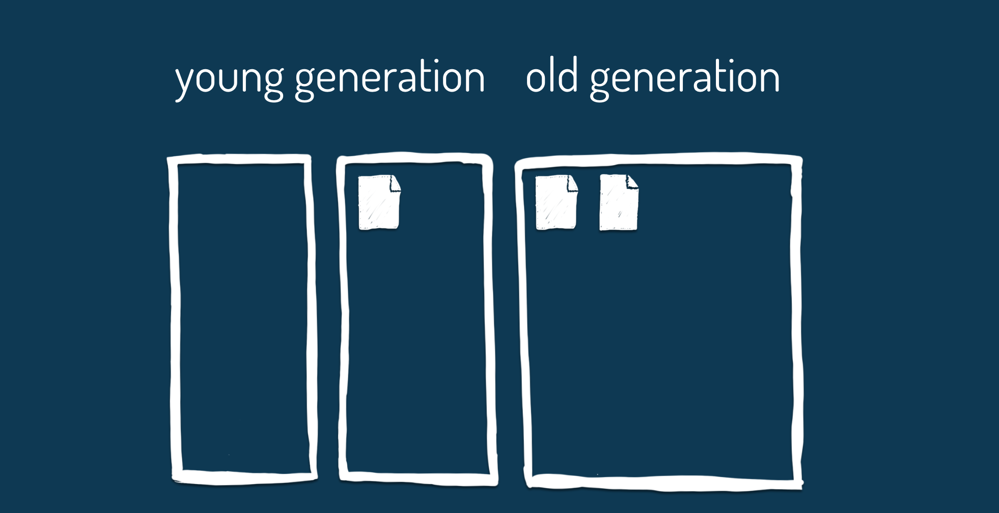

[Tilde](https://www.joezimjs.com/javascript/great-mystery-of-the-tilde/)

## Garbage collection

### General Introduction

#### V8

The garbage collector is not one single action. Memory is divided up into two areas: the young generation and the old generation.

V8 partitions its managed heap into generations where objects are initially allocated in the “nursery” of the young generation. Upon surviving a garbage collection, objects are copied into the intermediate generation, which is still part of the young generation. After surviving another garbage collection, these objects are moved into the old generation. V8 implements two garbage collectors: one that frequently collects the young generation, and one that collects the full heap including both the young and old generation. Old-to-young generation references are roots for the young generation garbage collection. These references are recorded to provide efficient root identification and reference updates when objects are moved.


Variables in JavaScript are mostly short-lived, used for a split-second for a single purpose and then discarded again. The young generation is specially designed to make this as fast as possible so your code is not held up. All new variables are allocated memory here, and organised into half-megabyte pages.

The young generation is partitioned into two semi-spaces. When a semi-space becomes full, a "minor" garbage collection begins. Variables are determined to be "living" or "dead" in a process called a scavenge. "Dead" variables are "unreachable", they were declared inside a function that has run its course and can no-longer be traced to living data. These variables are discarded. The minor garbage collection can take as little as 1ms, and the more dead data is discarded the more efficient the minor GC is.



"Living" variables that are still being used are moved to the second semi-space. Any living variables that are still being used after they've already been moved once are moved to the "old generation".

The old generation is designed for longer-lived data. Unlike the young generation, which is a small, agile part of memory, the old generation can expand to a very large size. When the size of the whole heap grows large enough, a major garbage collection begins.

The major GC undertakes a root-and-tip survey of the whole heap to find dead data. This process is called "marking", and its job is to find data that is not needed and mark it to be reclaimed. The more data that is stored in the older generation, the longer marking takes. This is significant because marking can pause your application, causing it to be unresponsive. Marking the heap can take up to 100ms, or six frames of animation, for very large applications. This latency is one of the major reasons why JavaScript struggles with high-performance applications such as videogames, and why webassembly is so exciting for the future.

V8, Chrome's implementation of JavaScript, breaks this process up into smaller 1ms chunks so that most applications keep running without any noticeable pauses. The V8 team has recently introduced concurrent marking, allowing around two-thirds of this process to happen in the background while your application keeps running.

The heap is then "swept", which makes memory usable again. Sweepers also run in the background while your application is running, so that your application can keep running.

Memory is compacted throughout garbage collection. The empty space left in pages of memory means data can be re-organised to make more efficient use of space, and reduces the amount of memory the browser uses.

The garbage collector then is a program running within the browser that frees up memory used by unreachable data. It assumes that all unreachable data is not needed and can be discarded. Problems with memory occur when we fill it up with data we don't need, or when data never becomes unreachable and memory is not freed. These problems are called memory bloat and memory leaks.

[Stolen from Katie Fenn](http://www.katiefenn.co.uk/memory-dont-forget-to-take-out-the-garbage/)

##### More info

[Orinoco: young generation garbage collection](https://v8project.blogspot.lt/2017/11/orinoco-parallel-scavenger.html)

[Jank Busters Part One](https://v8project.blogspot.lt/2015/10/jank-busters-part-one.html)

[Jank Busters Part Two](https://v8project.blogspot.lt/2016/04/jank-busters-part-two-orinoco.html)

[Fall cleaning: Optimizing V8 memory consumption](https://v8project.blogspot.lt/2016/10/fall-cleaning-optimizing-v8-memory.html)

#### Decorators

Great for binding class properties!

```javascript
class Form extends Component {
  value = ""

  @bound
  submit() {...} // as function declaration, on prototype

  @bound
  change() {...} // as function declaration, on prototype

  change = () => {...} // as function assignment, instance

  render() {
    <div>
      <input onChange={this.change} value={this.value} type="text" />
      <button onClick={this.submit}>Click</button>
    </div>
  }
}
```

Validations too!

```javascript
const stringValidator = target => {
  const { descriptor } = target;
  const value = descriptor.initializer();

  const proxy = new Proxy({}, {
    set(proxyTarget, key, proxyValue) {
      if (typeof proxyValue !== 'string') {
        throw new TypeError('value must be a string');
      }

      return true;
    }
  })

  const initializer = () => {
    proxy[name] = value;
    return proxy[name];
  }

  return {
    ...target,
    initializer
  }
}

class Book {
  @stringValidator
  bookOne = 'The Trial'; // all fine

  @stringValidator
  bookTwo = 1984; // throws a TypeError
}
```
