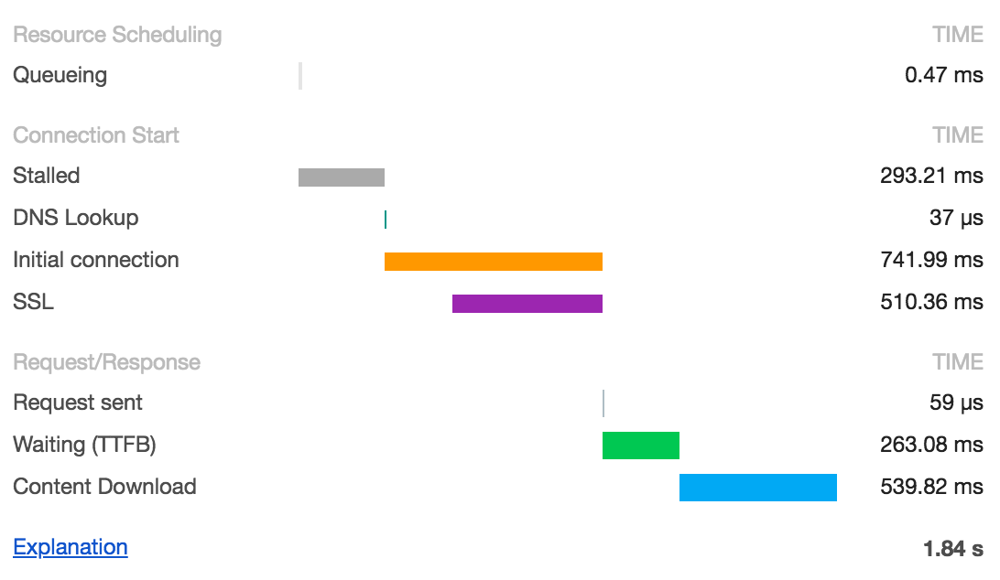

[CORS can take up two requests](https://news.ycombinator.com/item?id=17896973)
[Do You Really Know CORS?](http://performantcode.com/web/do-you-really-know-cors)


# TCP

[https://tls.ulfheim.net/](https://tls.ulfheim.net/) - Every byte of a TLS connection explained and reproduced.


### Request timing

#### CURL

```bash
$ cat .curlrc
-w "dnslookup: %{time_namelookup} | connect: %{time_connect} | appconnect: %{time_appconnect} | pretransfer: %{time_pretransfer} | starttransfer: %{time_starttransfer} | total: %{time_total} | size: %{size_download}\n"
```

```bash
$ curl -so /dev/null https://www.zasag.mn
dnslookup: 1.510 | connect: 1.757 | appconnect: 2.256 | pretransfer: 2.259 |
starttransfer: 2.506 | total: 3.001 | size: 53107
```


 - `time_namelookup` in this example takes a long time. To exclude DNS resolver performance from the figures, you can resolve the IP for cURL: --resolve www.zasag.mn:443:218.100.84.167. It may also be worth looking for a faster resolver :).
 - `time_connect` is the TCP three-way handshake from the client’s perspective. It ends just after the client sends the ACK - it doesn't include the time taken for that ACK to reach the server. It should be close to the round-trip time (RTT) to the server. In this example, RTT looks to be about 200 ms.
 - `time_appconnect` here is TLS setup. The client is then ready to send it’s HTTP GET request.
 - `time_starttransfer` is just before cURL reads the first byte from the network (it hasn't actually read it yet). time_starttransfer - time_appconnect is practically the same as Time To First Byte (TTFB) from this client - 250 ms in this example case. This includes the round trip over the network, so you might get a better guess of how long the server spent on the request by calculating TTFB - (time_connect - time_namelookup), so in this case, the server spent only a few milliseconds responding, the rest of the time was the network.
 - `time_total` is just after the client has sent the FIN connection tear down.

#### Chrome

Chrome, and some other testing tools, use the [W3C Resource Timing standard](https://www.w3.org/TR/resource-timing/) for measurements. In Chrome developer tools this looks like this:



Again, here’s how this maps onto a typical HTTP over TLS 1.2 connection, also showing the Resource Timing attribute names:


 - `Stalled` (fetchStart to domainLookupStart) is the browser waiting to start the connection, e.g. allocating cache on disk, if there are higher priority requests, or if there are already 6 connections open to this host.
 - `Initial connection` shown by Chrome is connectStart to connectEnd. Unlike cURL timings, this includes SSL connection setup, so if you want a fair estimate of RTT, this would be Initial connection - SSL. If an existing connection is being reused, then DNS Lookup, Initial connection and SSL won't be shown.
 - `Request sent` is connectEnd - requestStart, which should be negligible.
 - Similarly to cURL, if we subtract the TCP handshake time from TTFB, we can guess the amount of time the server really spent processing (again, we don't have an exact RTT timing, so this is a approximation).

Based on [A Question of Timing](https://blog.cloudflare.com/a-question-of-timing/amp/)


## Headers

`Server Timing` header. [Spec](https://www.w3.org/TR/server-timing/). [Intro](https://www.smashingmagazine.com/2018/10/performance-server-timing/)